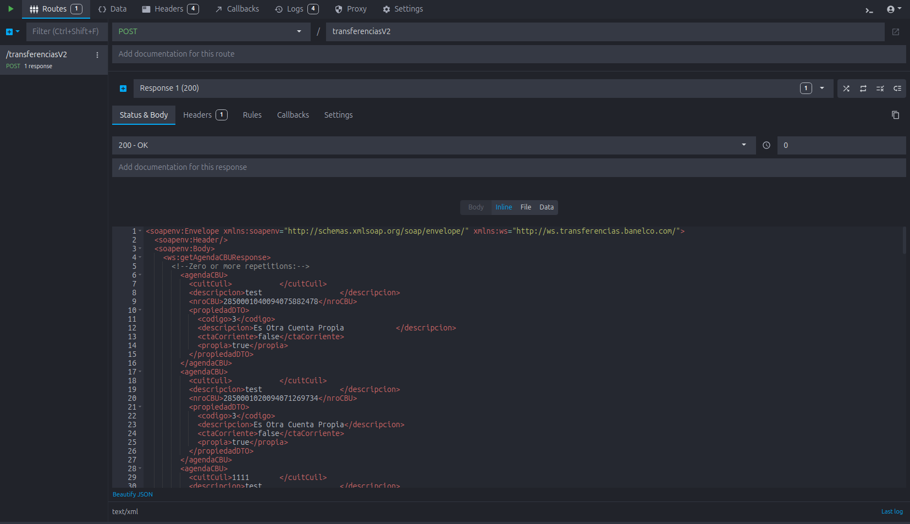
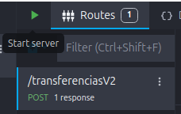
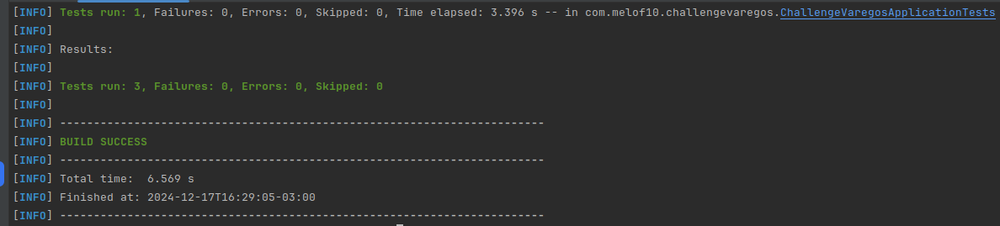
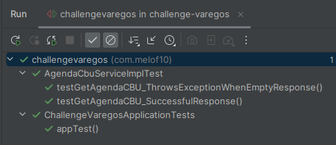
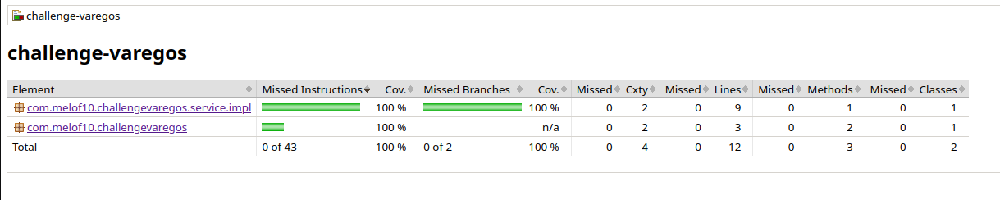
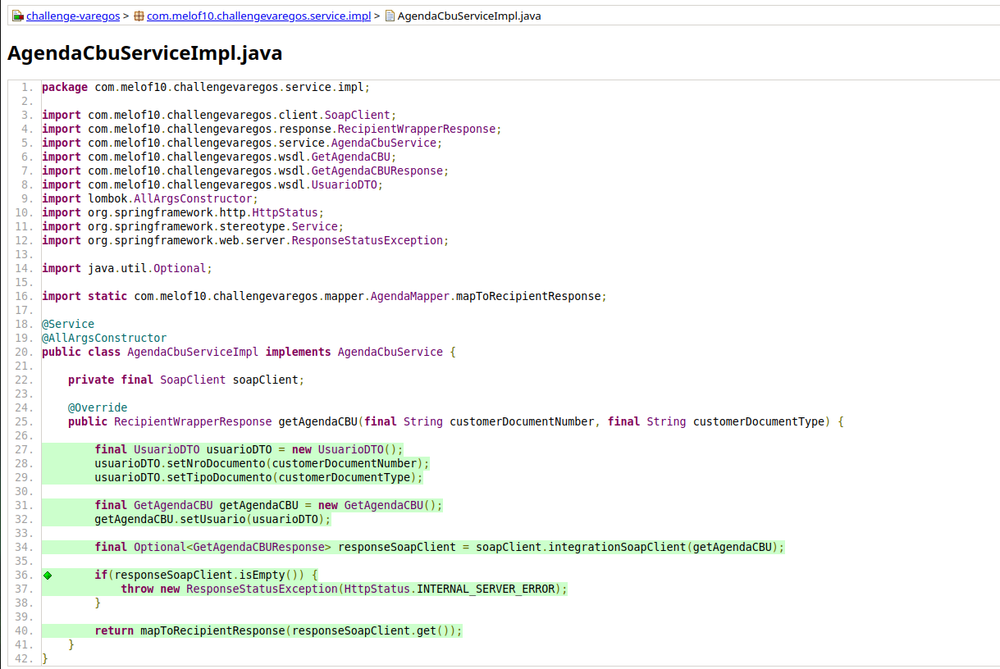
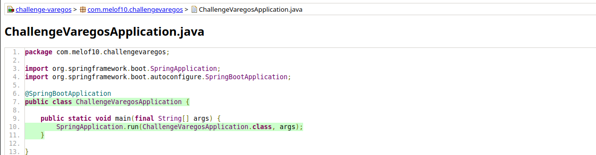
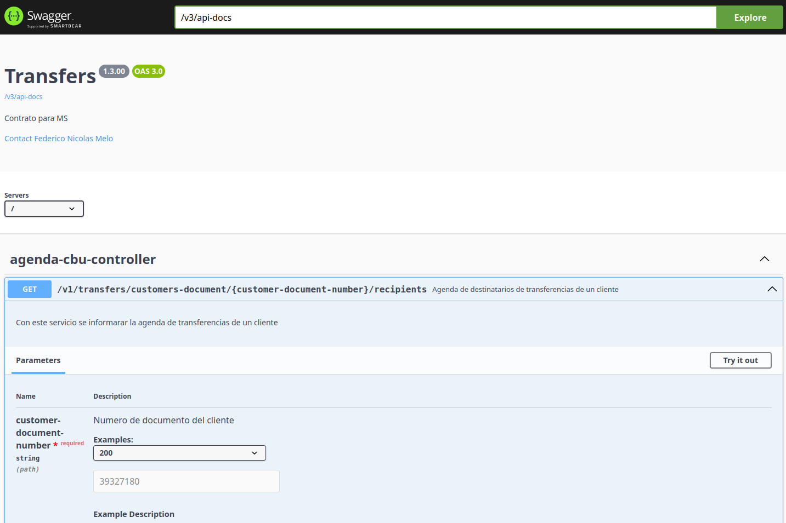
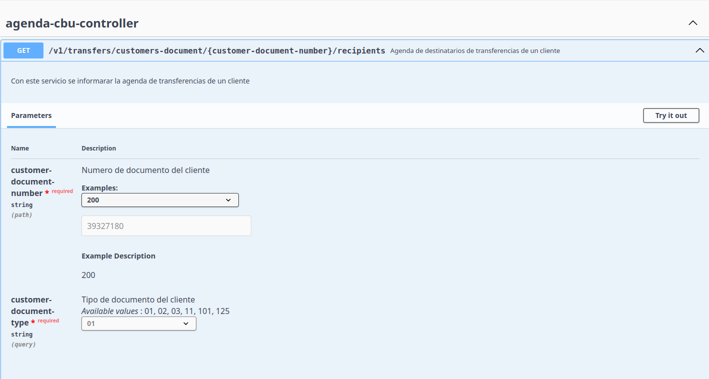
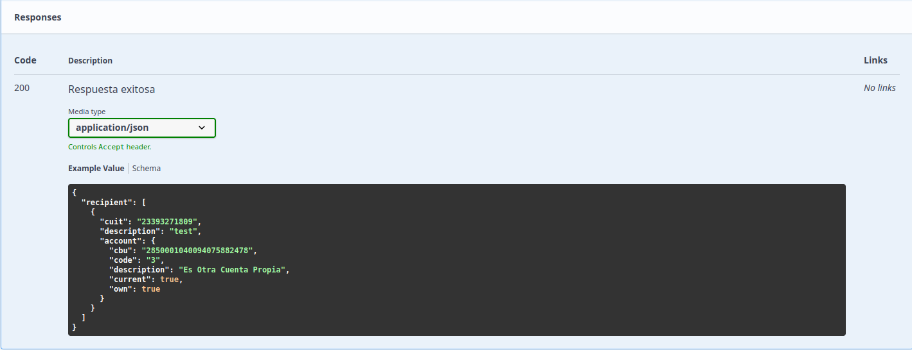

# 🚀 Evaluación Técnica VAREGOS - Java Spring Boot 
> Este proyecto implementa una API REST que permite obtener información de **CBU bancarios** consumiendo servicios a través de una integración con un cliente SOAP. Se garantiza un desarrollo limpio, con pruebas unitarias, manejo de errores y reporte de cobertura.

- **[Desarrollador Principal]** - Federico Nicolás Melo - **Linkedin:** https://www.linkedin.com/in/federico-nicolas-melo
- **[Estado del Proyecto]**: **`✅ Finalizado`**

---

## 📝 Índice
1. [Descripción del Proyecto](#descripcion-del-proyecto)
2. [Tecnologías Utilizadas](#tecnologias-utilizadas)
3. [Requisitos Previos](#requisitos-previos)
4. [Instalación y Configuración](#instalación-y-configuración)
5. [Ejecución](#ejecución)
6. [Estructura del Proyecto](#estructura-del-proyecto)
7. [Endpoints / API REST](#endpoints--api-rest)
8. [Pruebas](#pruebas)
9. [Cobertura de Código](#cobertura-de-código)
10. [Swagger](#swagger)
11. [Resultado Final](#resultado-final)

---

## **Descripcion del Proyecto**
- Desarrollo de una API REST utilizando Spring Boot que exponga un esquema definido en OpenAPI y conecte con un backend SOAP, asegurando un correcto mapeo de campos entre ambos sistemas, cumpliendo con el caso exitoso especificado (HTTP 200 OK).
- Este proyecto resuelve varios problemas técnicos y prácticos relacionados con la integración de sistemas heterogéneos y la exposición de servicios. Algunos de los problemas clave que aborda son:
  1. **Integración entre REST y SOAP:**
  Facilita la interoperabilidad entre una API REST moderna y un backend legacy basado en SOAP, manejando las diferencias en formato y estructura de datos.
  2. **Mapeo de Esquemas Complejos:**
     Resuelve el desafío de mapear campos entre un esquema OpenAPI (JSON) y el formato SOAP (XML), simplificando la transformación de datos entre ambos.
  3. **Pruebas Sin Dependencias del Backend:**
     Permite pruebas locales utilizando un mock (simulación del backend SOAP), lo que elimina la dependencia de un servicio externo durante el desarrollo y garantiza una mayor estabilidad.
  4. **Documentación y Estandarización:**
     Expone una API documentada automáticamente mediante Swagger, asegurando que otros desarrolladores puedan comprender y consumir los servicios con facilidad.
  5. **Ejecución Simplificada:**
     Proporciona un entorno listo para ejecutarse, con instrucciones claras para levantar la aplicación y realizar pruebas, acelerando la adopción por otros equipos o desarrolladores.

---

## **Tecnologias Utilizadas**

- **Java 21**
- **Spring Boot 3.4.0**
- **JUnit 5** y **Mockito**
- **Maven** (gestor de dependencias)
- **Jacoco** (para medición de cobertura de código)
- **SOAP Web Services**
- **Swagger/OpenAPI** (para documentación de la API)
- **Postman** (Para probar nuestra API REST)
- **Mockoon** (Para crear una fake API para nuestro cliente SOAP)

---

## **Requisitos Previos**

- **Java Development Kit (JDK) 21**
- **Maven 3.8+**
- **Postman**
- **Mockoon**
- **IDE**: IntelliJ IDEA / Eclipse / VS Code

---

## **Instalación y Configuración**

- Levantar el cliente SOAP en Mockoon
    1. Abrir Mockoon
    2. Importar el archivo que se encuentra en `docs/challenge-varegos.json` de nuestro proyecto en la aplicación Mockoon
    3. Copiar y pegar el contenido de `docs/mock-response.xml` en la sección response de nuestro servidor tal como vemos en la imagen<br/><br/>
       <br/><br/>
    4. Luego ejecutar en Iniciar para levantar nuestro cliente SOAP<br/><br/> 
       
    5. Importar la colección que se encuentra en `docs/Challenge Varegos.postman_collection.json` a Postman
    

- Compila el proyecto:
   ```bash
   mvn clean install
   ```  

---

## **Ejecución**
Como correr la aplicación localmente:

### **Ejecutar con Maven**
```bash
mvn spring-boot:run
```

La aplicación estará disponible en:
> **http://localhost:8080**

---

## **Estructura del Proyecto**

```plaintext
src/main/java/com/melof10/challengevaregos
├── client           # Cliente SOAP
├── config           # Configuraciones generales del proyecto
├── controller       # Controladores de la API REST
├── enumeration      # Enums para mantener los datos en un sólo lugar
├── mapper           # Mappers para convertir entre entidades y DTOs
├── response         # Clases para las respuesta de la API REST
├── service          # Lógica de negocio
│   └── impl         # Implementaciones de servicios
├── utils            # Clases de utilidades
└── wsdl             # Clases generadas desde el archivo PRISMA_TransferenciasService.wsdl

```

Para poder generar las clases de la carpeta `wsdl` se corrió el siguiente comando
> **wsimport -keep -d src/main/java -s src/main/java -p com.melof10.challengevaregos.wsdl src/main/resources/docs/PRISMA_TransferenciasService.wsdl**

Luego se cambiaron la mayoría de los `import` de javax a jakarta una vez generados estas clases de la carpeta wsdl

---

## **Endpoints / API REST**

| Método | Endpoint                                                                                              | Descripción           |
|--------|-------------------------------------------------------------------------------------------------------|-----------------------|
| POST   | `http://localhost:8080/v1/transfers/customers-document/32345379/recipients?customer-document-type=01` | Obtener agenda de CBU |

**Ejemplo de Respuesta OK (200):**
```json
{
  "recipient": [
    {
      "cuit": "23393271809",
      "description": "test",
      "account": {
        "cbu": "2850001040094075882478",
        "code": "3",
        "description": "Es Otra Cuenta Propia",
        "current": true,
        "own": true
      }
    }
  ]
}
```

**Ejemplo de Respuesta BAD REQUEST (400):**
    Esto ocurre cuando los parámetros de entrada como `customer-document-number` ó `customer-document-type` son pasados de forma errónea o se colocan datos nulos
```json
{
  "code": 400,
  "error": "El número y tipo de documento son obligatorios"
}
```

**Ejemplo de Respuesta INTERNAL SERVER ERROR (500):**
    Esto ocurre si nuestro cliente SOAP no responde o está caído
```json
{
  "code": 500,
  "error": "Error al conectarse con el cliente SOAP"
}
```

---

## **Pruebas**
La API incluye pruebas unitarias en el cual generará un reporte html

### **Ejecutar las Pruebas**
```bash
mvn test
```  

Resultado final de la ejecución de los test<br/><br/>


Resultado final de la ejecución de los test desde el IDE<br/><br/>


---

### **Reporte de Cobertura con Jacoco**
Una vez que hayas corrido el comando `mvn clean install`, el reporte HTML se genera en la siguiente carpeta
> `target/site/jacoco/index.html`

---

## **Cobertura de Código**
Incluye la cobertura de código lograda con Jacoco:

- **Cobertura de Líneas**: 80%
- **Cobertura de Ramas**: 85%





---

## **Swagger**

**Swagger UI**:Podremos acceder a nuestro swagger en la siguiente url para probar nuestra API REST
   > `http://localhost:8080/swagger-ui/index.html`





## **Resultado Final**
Se adjunta las diferentes respuestas de nuestra API REST

* (HTTP 200 OK)
```json
{
  "recipient": [
    {
      "cuit": null,
      "description": "test",
      "account": {
        "cbu": "2850001040094075882478",
        "code": "3",
        "description": "Es Otra Cuenta Propia",
        "current": false,
        "own": true
      }
    },
    {
      "cuit": null,
      "description": "test",
      "account": {
        "cbu": "2850001020094071269734",
        "code": "3",
        "description": "Es Otra Cuenta Propia",
        "current": false,
        "own": true
      }
    },
    {
      "cuit": "1111",
      "description": "test",
      "account": {
        "cbu": "0070033730004023804130",
        "code": "4",
        "description": "Es Otra Cuenta No Propia",
        "current": false,
        "own": false
      }
    },
    {
      "cuit": null,
      "description": "A",
      "account": {
        "cbu": "2850000320094032777694",
        "code": "4",
        "description": "Es Otra Cuenta No Propia",
        "current": false,
        "own": false
      }
    },
    {
      "cuit": null,
      "description": "A",
      "account": {
        "cbu": "2850000320094034926414",
        "code": "4",
        "description": "Es Otra Cuenta No Propia",
        "current": false,
        "own": false
      }
    },
    {
      "cuit": null,
      "description": "A",
      "account": {
        "cbu": "2850000320094035874484",
        "code": "4",
        "description": "Es Otra Cuenta No Propia",
        "current": false,
        "own": false
      }
    },
    {
      "cuit": null,
      "description": "A",
      "account": {
        "cbu": "2850001020094052701404",
        "code": "4",
        "description": "Es Otra Cuenta No Propia",
        "current": false,
        "own": false
      }
    },
    {
      "cuit": null,
      "description": "A",
      "account": {
        "cbu": "2850001020094054075204",
        "code": "4",
        "description": "Es Otra Cuenta No Propia",
        "current": false,
        "own": false
      }
    },
    {
      "cuit": null,
      "description": "A",
      "account": {
        "cbu": "2850001020094054176334",
        "code": "4",
        "description": "Es Otra Cuenta No Propia",
        "current": false,
        "own": false
      }
    },
    {
      "cuit": null,
      "description": "A",
      "account": {
        "cbu": "2850001020094056777924",
        "code": "4",
        "description": "Es Otra Cuenta No Propia",
        "current": false,
        "own": false
      }
    },
    {
      "cuit": null,
      "description": "A",
      "account": {
        "cbu": "2850001020000830793374",
        "code": "4",
        "description": "Es Otra Cuenta No Propia",
        "current": false,
        "own": false
      }
    },
    {
      "cuit": null,
      "description": "A",
      "account": {
        "cbu": "2850001020000852364394",
        "code": "4",
        "description": "Es Otra Cuenta No Propia",
        "current": false,
        "own": false
      }
    },
    {
      "cuit": null,
      "description": "A",
      "account": {
        "cbu": "2850001020094074213424",
        "code": "4",
        "description": "Es Otra Cuenta No Propia",
        "current": false,
        "own": false
      }
    },
    {
      "cuit": null,
      "description": "A",
      "account": {
        "cbu": "2850001020094074741594",
        "code": "4",
        "description": "Es Otra Cuenta No Propia",
        "current": false,
        "own": false
      }
    },
    {
      "cuit": null,
      "description": "A",
      "account": {
        "cbu": "2850001020094076627744",
        "code": "4",
        "description": "Es Otra Cuenta No Propia",
        "current": false,
        "own": false
      }
    },
    {
      "cuit": null,
      "description": "A",
      "account": {
        "cbu": "2850001020094076643454",
        "code": "4",
        "description": "Es Otra Cuenta No Propia",
        "current": false,
        "own": false
      }
    },
    {
      "cuit": null,
      "description": "A",
      "account": {
        "cbu": "2850001020094077534304",
        "code": "4",
        "description": "Es Otra Cuenta No Propia",
        "current": false,
        "own": false
      }
    },
    {
      "cuit": null,
      "description": "prueba test alerta",
      "account": {
        "cbu": "2850025640094949061008",
        "code": "4",
        "description": "Es Otra Cuenta No Propia",
        "current": false,
        "own": false
      }
    },
    {
      "cuit": null,
      "description": "alerta 3ros",
      "account": {
        "cbu": "2850682740095210170348",
        "code": "4",
        "description": "Es Otra Cuenta No Propia",
        "current": false,
        "own": false
      }
    },
    {
      "cuit": null,
      "description": "vale22",
      "account": {
        "cbu": "2850001020094066077034",
        "code": "3",
        "description": "Es Otra Cuenta Propia",
        "current": false,
        "own": true
      }
    },
    {
      "cuit": null,
      "description": "Cta tercero banco Macr",
      "account": {
        "cbu": "2850001030094005821211",
        "code": "4",
        "description": "Es Otra Cuenta No Propia",
        "current": false,
        "own": false
      }
    },
    {
      "cuit": null,
      "description": "CC Capezio",
      "account": {
        "cbu": "2850001030094012343241",
        "code": "2",
        "description": "Es Una Cuenta Corriente No Propia",
        "current": true,
        "own": false
      }
    },
    {
      "cuit": null,
      "description": "CTA pro Yung",
      "account": {
        "cbu": "2850025640094014048158",
        "code": "3",
        "description": "Es Otra Cuenta Propia",
        "current": false,
        "own": true
      }
    },
    {
      "cuit": null,
      "description": "Netri Daniel",
      "account": {
        "cbu": "2850672840027388702207",
        "code": "4",
        "description": "Es Otra Cuenta No Propia",
        "current": false,
        "own": false
      }
    },
    {
      "cuit": null,
      "description": "familcar",
      "account": {
        "cbu": "2850001040094059465088",
        "code": "4",
        "description": "Es Otra Cuenta No Propia",
        "current": false,
        "own": false
      }
    }
  ]
}
```
* (HTTP 400 BAD REQUEST)
```json
{
  "code": 400,
  "error": "El número y tipo de documento son obligatorios"
}
```
* (HTTP 500 INTERNAL SERVER ERROR)
```json
{
  "code": 500,
  "error": "Error al conectarse con el cliente SOAP"
}
```